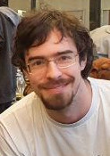
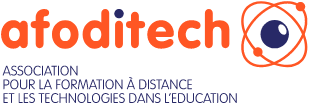

# Philippe Berset

Hello and welcome to this corner of the web.

I'm an educational engineer with a passion for technology, mountain hiking and martial arts.

Here you'll find a summary of my [work experience](./about.en.md), [creations](./projects.en.md) and thoughts.

You can also check out my [Linkedin](https://www.linkedin.com/in/philippe-berset-edtech/) profile if you'd like to chat with me.

Looking forward to hearing from you!

# AFODITECH

I am a founding and active member of the [AFODITECH] association (https://afoditech.ch/).

Through the association, my personal aim is to democratise the use of IT in education.

Today's technologies offer powerful tools to support trainers and learners.

However, the use of IT in training is not as democratised as you might think, and I hope to make my contribution by providing a framework for the use of technology in training.