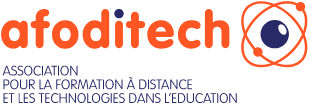

# Philippe Berset

Salut et bienvenue dans ce coin du web.
Je suis un ingénieur pédagogique passionné par la technologie, la randonnée en montagne et les arts martiaux.

Vous trouverez ici un résumé de mon [expérience professionnelle](about.md), [mes créations](projects.md) et mes réflexions.
Vous pouvez également consulter mon profil [Linkedin](https://www.linkedin.com/in/philippe-berset-edtech/) si vous voulez discuter avec moi.

Au plaisir !

# AFODITECH

Je suis membre fondateur et actif de l'association [AFODITECH](https://afoditech.ch/).
Au travers de l'association, mon objectif personnel est de démocratiser l'utilisation de l'informatique dans l'éducation.

Les technologies actuelles offrent des outils d'une grande puissance pour soutenir les formateurs et les apprenants.
Cependant, l'usage de l'informatique en formation n'est pas aussi démocratisé que l'on pourrait le croire et j'aspire à apporter ma pierre à l'édifice en cadrant l'usage des technologies pour la formation.